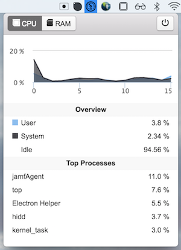
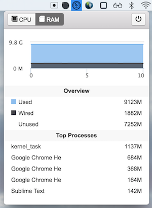

# iStats
An Electron app to display CPU and memory stats on Mac menubar.

## App Preview

## Screenshots

### Download
Please download at [release](https://github.com/ningt/iStats/releases) page.

## Components Used
- [os-usage](https://github.com/ningt/os-usage) - Node module to track Mac OS system usage in real time
- [menubar](https://github.com/maxogden/menubar) - high level way to create menubar desktop applications with electron

## Run it on your Mac
- Clone this repo `https://github.com/ningt/iStats.git`
- `cd iStats`
- run `npm install && npm start`